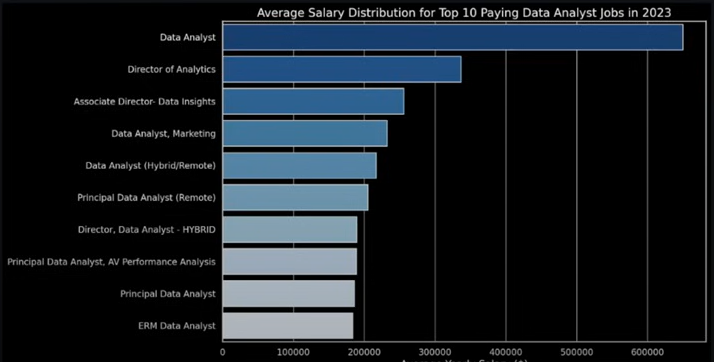
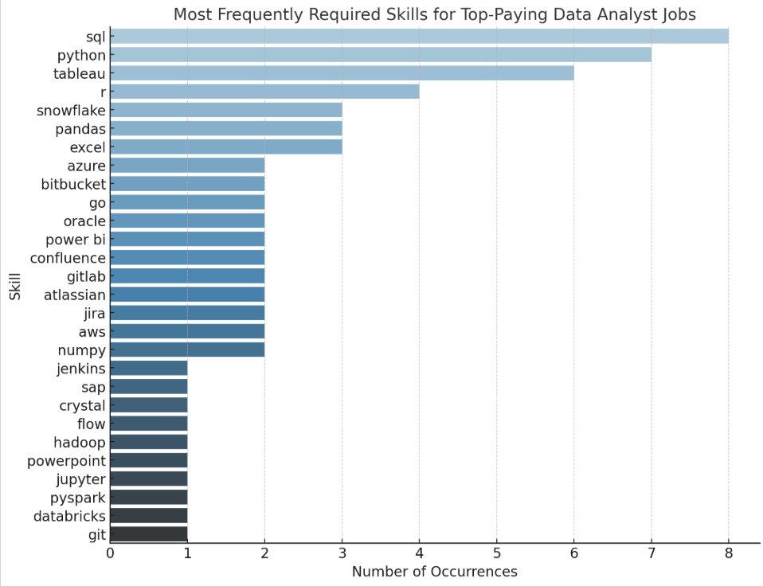

# Introduction
🧠 Dive into the data job market! Focusing on data analyst roles, this project explores 💰 top-paying jobs, 🔥 in-demand skills, and ☑️ where high demand meets high salary in data analytics.

🔍 SQL queries? Check them out here: [SQL_project folder](/SQL_project/)

# Background
Driven by a quest to navigate the data analyst job market more effectively, this project was born from a desire to pinpoint top-paid and in-demand skills, streamlining others' work to find optimal jobs.

### The questions I wanted to answer through my SQL queries were:
1. What are the top-paying data analyst jobs?

2. What skills are required for these top-paying jobs?

3. What skills are most in demand for data analysts?

4. Which skills are associated with higher salaries?

5. What are the most optimal skills to learn?


# Tools used
For my deep dive into the data analyst job market, I harnessed the power of several key tools:

- **SQL:** The backbone of my analysis, allowing me to query the database and unearth critical insights.

- **PostgreSQL:** The chosen database management system, ideal for handling the job posting data.

- **Visual Studio Code:** My go-to for database management and executing SQL queries.

- **Git & GitHub:** Essential for version control and sharing my SQL scripts and analysis, ensuring collaboration and project tracking.


# The analysis
Each query for this project aimed at investigating specific aspects of the data analyst job market. 

Here's how I approached each question: 

### 1. Top Paying Data Analyst Jobs
To identify the highest-paying roles, I filtered data analyst positions by average yearly salary and location, focusing on remote jobs. This query highlights the high paying opportunities in the field.

```sql
SELECT 
    job_id,
    job_title,
    salary_year_avg,
    name AS comapny_name
FROM
    job_postings_fact
LEFT JOIN company_dim ON job_postings_fact.company_id = company_dim.company_id
WHERE 
    job_title_short = 'Data Analyst' AND 
    job_location = 'Anywhere' AND
    salary_year_avg IS NOT NULL
ORDER BY
    salary_year_avg DESC
LIMIT 10;
```

Here’s the breakdown of the top data analyst jobs in 2023:

- **Wide Salary Range:** Top 10 paying data analyst roles span from $184,000 to $650,000, indicating significant salary potential in the field.

- **Diverse Employers:** Companies like SmartAsset, Meta, and AT&T are among those offering high salaries, showing a broad interest across different industries.

- **Job Title Variety:** There’s a high diversity in job titles, from Data Analyst to Director of Analytics, reflecting varied roles and specializations within data analytics.


*Bar graph visualizing the salary for the top 10 salaries for data analyst; ChatGPT generated this graph from my SQL query result*


### 2. Skills required for top paying jobs
To understand the skills required for top-paying data analyst jobs, I analyzed the job postings for these roles.

```sql
WITH top_paying_jobs AS (
    SELECT 
        job_id,
        job_title,
        salary_year_avg,
        name AS comapny_name
    FROM
        job_postings_fact
    LEFT JOIN company_dim ON job_postings_fact.company_id = company_dim.company_id
    WHERE 
        job_title_short = 'Data Analyst' AND 
        job_location = 'Anywhere' AND
        salary_year_avg IS NOT NULL
    ORDER BY
        salary_year_avg DESC
    LIMIT 10
)
SELECT
    top_paying_jobs.*,
    skills
FROM top_paying_jobs
INNER JOIN skills_job_dim ON top_paying_jobs.job_id = skills_job_dim.job_id
INNER JOIN skills_dim ON skills_job_dim.skill_id = skills_dim.skill_id
ORDER BY
    salary_year_avg DESC;
```

Here's a breakdown of the above query:

- SQL, Python, and Tableau are the top 3 skills, appearing in the majority of high-paying job postings.

- Other commonly sought-after tools include R, Snowflake, Pandas, and Excel, reflecting the demand for strong programming and data visualization expertise.

- Employers are increasingly favoring candidates proficient in cloud platforms (Azure, AWS) and collaboration tools (Git, Jira, Confluence).

This insight helps professionals prioritize learning these skills to align with industry demands and maximize their salary potential.


*Bar graph visualizing the most frequently requied skills for top paying data analyst job roles*

### 3. Top demanded skills
- To identify the top demanded skills for data analyst roles, I analyzed the job postings for these positions. 

- This helped uncover which technical and analytical skills are most frequently mentioned by employers in high-paying opportunities. 

- The analysis provides valuable insights for professionals aiming to align their skillsets with current industry demands.


```sql
SELECT 
    skills,
    COUNT(skills_job_dim.job_id) AS demand_count
FROM
    job_postings_fact
INNER JOIN skills_job_dim ON job_postings_fact.job_id = skills_job_dim.job_id
INNER JOIN skills_dim ON skills_job_dim.skill_id = skills_dim.skill_id
WHERE
    job_title_short = 'Data Analyst' AND
    job_work_from_home = TRUE
GROUP BY
    skills
ORDER BY
    demand_count DESC
LIMIT 5;
```
Here's a breakdown of the above query:
1. SQL dominates the list with 7,291 mentions, highlighting it as the most essential skill for data analysts to query and manage databases effectively.

2. Excel and Python follow closely, showcasing the importance of both traditional spreadsheet tools and modern programming for data cleaning, manipulation, and automation.

3. Tableau and Power BI indicate the high demand for data visualization skills, as organizations prioritize presenting insights in interactive and intuitive formats.

Together, these skills form the core toolkit for data analysts in today’s job market, bridging technical expertise and business reporting needs.


| **Skill**   | **Demand Count** |
|-------------|-------------------|
| SQL         | 7,291             |
| Excel       | 4,611             |
| Python      | 4,330             |
| Tableau     | 3,745             |
| Power BI    | 2,609             |


### 4. Top paying skills
- To determine the top paying skills for data analyst roles, I analyzed the job postings for these positions
- This helped uncover which technical and analytical skills are most frequently mentioned by employers in high-paying opportunities
- The analysis provides valuable insights for professionals aiming to align their skillsets with current industry demands

```sql
SELECT 
    skills,
    ROUND(AVG(salary_year_avg),0) AS avg_salary
FROM
    job_postings_fact
INNER JOIN skills_job_dim ON job_postings_fact.job_id = skills_job_dim.job_id
INNER JOIN skills_dim ON skills_job_dim.skill_id = skills_dim.skill_id
WHERE
    job_title_short = 'Data Analyst' AND
    salary_year_avg IS NOT NULL
    -- job_work_from_home = TRUE
GROUP BY
    skills
ORDER BY
    avg_salary DESC
LIMIT 25;
```

Here are some useful insights:
1. **High Demand for Big Data & ML Skills:** Top salaries are commanded by analysts skilled in big 
data technologies (PySpark, Couchbase), machine learning tools (DataRobot, Jupyter), and Python 
libraries (Pandas, NumPy), reflecting the industry's high valuation of data processing and predictive 
modeling capabilities.

2. **Software Development & Deployment Proficiency:** Knowledge in development and deployment tools (GitLab, 
Kubernetes, Airflow) indicates a lucrative crossover between data analysis and engineering, with a premium 
on skills that facilitate automation and efficient data pipeline management.

3. **Cloud Computing Expertise:** Familiarity with cloud and data engineering tools (Elasticsearch, Databricks, GCP)
underscores the growing importance of cloud-based analytics environments, suggesting that cloud proficiency 
significantly boosts earning potential in data analytics.


### 5. Most optimal skills
This query gives us some insights on which skills are most associated with high-paying remote Data Analyst jobs, their demand frequency across job postings.
It also lets us identify high-value skills (even if their demand isn’t the highest).

```sql
WITH skills_demand AS (
    SELECT
        skills_dim.skill_id, 
        skills,
        COUNT(skills_job_dim.job_id) AS demand_count
    FROM
        job_postings_fact
    INNER JOIN skills_job_dim ON job_postings_fact.job_id = skills_job_dim.job_id
    INNER JOIN skills_dim ON skills_job_dim.skill_id = skills_dim.skill_id
    WHERE
        job_title_short = 'Data Analyst'
        AND salary_year_avg IS NOT NULL
        AND job_work_from_home = TRUE
    GROUP BY
        skills_dim.skill_id
), average_salary AS (
    SELECT 
        skills_dim.skill_id,
        skills,
        ROUND(AVG(salary_year_avg),0) AS avg_salary
    FROM
        job_postings_fact
    INNER JOIN skills_job_dim ON job_postings_fact.job_id = skills_job_dim.job_id
    INNER JOIN skills_dim ON skills_job_dim.skill_id = skills_dim.skill_id
    WHERE
        job_title_short = 'Data Analyst' 
        AND salary_year_avg IS NOT NULL
        AND job_work_from_home = TRUE
    GROUP BY
        skills_dim.skill_id
)

SELECT 
    skills_demand.skill_id,
    skills_demand.skills,
    demand_count,
    avg_salary
FROM 
    skills_demand
INNER JOIN average_salary ON skills_demand.skill_id = average_salary.skill_id
WHERE 
    demand_count > 10
ORDER BY
    avg_salary DESC,
    demand_count DESC

LIMIT 25;
```

- The query identifies the top 25 skills for remote Data Analyst roles by calculating their demand across job postings and the average salary offered for each skill. 

- It highlights which skills are both highly valued and high-paying, helping professionals prioritize their learning.

# What I learned 
Throughout this adventure, I've turbocharged my SQL toolkit with some serious firepower:

✨🛠 **Complex Query Crafting:** Mastered the art of advanced SQL, merging tables like a pro and wielding WITH clauses for ninja-level temp table maneuvers.

📊📈 **Data Aggregation:** Got cozy with GROUP BY and turned aggregate functions like COUNT() and AVG() into my data-summarizing sidekicks.

🧠💡 **Analytical Wizardry:** Leveled up my real-world puzzle-solving skills, turning questions into actionable, insightful SQL queries.

# Conclusion

### Insights
1. **Top-Paying Data Analyst Jobs:** The highest-paying jobs for data analysts that allow remote work offer a wide range of salaries, the highest at $650,000!

2. **Skills for Top-Paying Jobs:** High-paying data analyst jobs require advanced proficiency in SQL, suggesting it’s a critical skill for earning a top salary.

3. **Most In-Demand Skills:** SQL is also the most demanded skill in the data analyst job market, thus making it essential for job seekers.

4. **Skills with Higher Salaries:** Specialized skills, such as SVN and Solidity, are associated with the highest average salaries, indicating a premium on niche expertise.

5. **Optimal Skills for Job Market Value:** SQL leads in demand and offers a high average salary, positioning it as one of the most optimal skills for data analysts to learn to maximize their market value.

### Closing Thoughts
This project enhanced my SQL skills and provided valuable insights into the data analyst job market. The findings from the analysis serve as a guide to prioritizing skill development and job search efforts. Aspiring data analysts can better position themselves in a competitive job market by focusing on high-demand, high-salary skills. This exploration highlights the importance of continuous learning and adaptation to emerging trends in the field of data analytics.